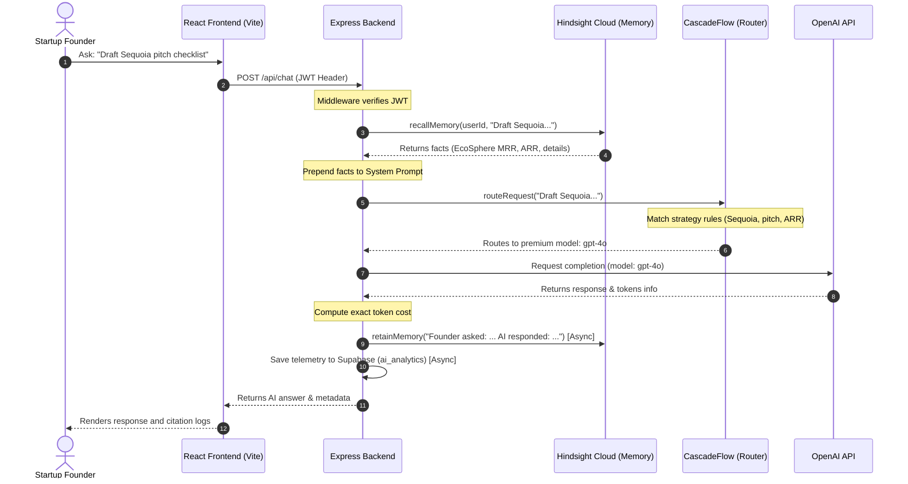

# FounderMind — AI Chief of Staff with Persistent Memory & Model Cascading

FounderMind is a premium, context-aware AI Chief of Staff designed specifically for startup founders. Unlike generic chatbots, FounderMind retains long-term memory of company KPIs, strategy, task logs, and meeting context using Hindsight Cloud, while optimizing LLM execution costs and latency dynamically through a CascadeFlow routing layer.

---

## Architecture Flow

Below is the dynamic execution flow representing authentication, context retrieval, intelligent model cascading, and memory persistency loops:



---

## Key Features

- **JWT Authentication**: Secure user login and signup with password hashing. Each user gets an isolated context scope.
- **Hindsight Persistent Memory**: Automatically extracts and indexes key startup parameters (MRR, investor conversations, product goals) and recalls them dynamically in future sessions.
- **CascadeFlow Routing Rules**:
  - `Greetings` -> lightweight `gpt-4o-mini` (minimizes token cost).
  - `Strategy / Finance` (Sequoia, Pitch, Mrr, Arr) -> flagship `gpt-4o` (maximizes context quality).
  - `Long Context` (history length &ge; 8) -> `gpt-4o` (high coherence).
  - `Default` -> `gpt-4o-mini`.
- **Automatic Fallback Recovery**: If the primary LLM fails (rate limit, API down), CascadeFlow instantly cascades to a fallback model.
- **AI Analytics Dashboard**: High-fidelity chart cards rendering today's spend ($), request counts, model usage ratios, and real-time query metrics.

---

## Onboarding & Setup

### 1. Prerequisites
- **Node.js**: v18+
- **Supabase**: Set up a Supabase project and execute the migrations inside [init_schema.sql](file:///C:/Users/user/.gemini/antigravity-ide/scratch/foundermind/backend/init_schema.sql).
- **Hindsight Cloud**: Sign up at [hindsight.vectorize.io](https://hindsight.vectorize.io) to obtain an API key.

### 2. Environment Configuration
Create a `.env` file in the `backend/` directory:
```env
PORT=5000

# Supabase
SUPABASE_URL=https://your-supabase-url.supabase.co
SUPABASE_SERVICE_KEY=your-supabase-service-key

# JWT
JWT_SECRET=your_super_secret_jwt_key_min_32_chars

# OpenAI
OPENAI_API_KEY=sk-your-openai-api-key
OPENAI_MODEL=gpt-4o-mini

# Hindsight Cloud
HINDSIGHT_BASE_URL=https://api.hindsight.vectorize.io
HINDSIGHT_API_KEY=your_hindsight_api_key
```

### 3. Local Development Start
Run the following in separate terminal screens:

**Backend Setup**:
```bash
cd backend
npm install
npm run dev
```

**Frontend Setup**:
```bash
# In the project root
npm install
npm run dev
```

Open `http://localhost:5173` in your browser.

---

## Testing Guide

### Verify Context Memory & Model Cascading
1. Register a new user (`founder@test.co`).
2. Navigate to **Memory** and enter a custom fact:
   > "Our startup name is EcoSphere and we have $12,000 MRR."
3. Open **AI Chat** and submit: `Hi, how are you?`
   - Observe in console/terminal that CascadeFlow routes to `gpt-4o-mini` (Greeting rule).
4. Send a strategy query: `Draft a pitch intro email.`
   - Observe that the response includes your startup name **EcoSphere** and MRR metric.
   - Observe that the request was routed to `gpt-4o` (Strategy keyword matching).
5. Open **AI Analytics** and review the dynamic model graphs and spend metrics.
